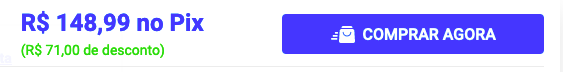
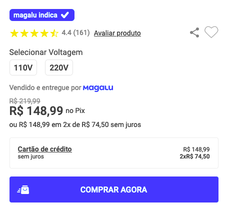
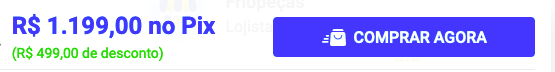
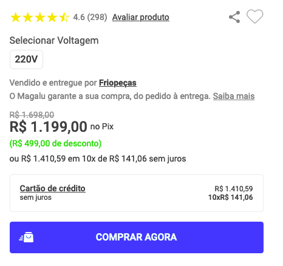

# AIM conversion test

You shouldn't encounter any issues running the [script](https://raw.githubusercontent.com/caiankeller/aim-test/main/aim.js). Simply copy and paste the command into the console, and everything should proceed smoothly. Sometimes, the product won't have those \<span\> tags. They won't disrupt the script, but the script won't add the \<span\> tags either.

## Without \<span\>

## With \<span\>

